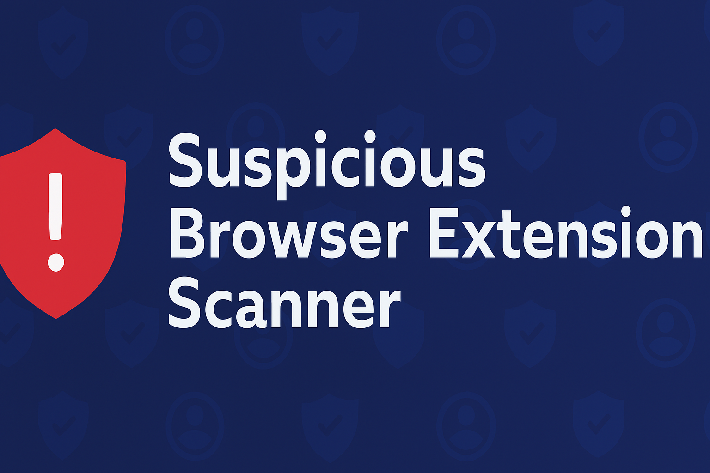

  

---

 

# 🔍 Suspicious Browser Extension Scanner

This project was created as part of the Elevate Labs Cybersecurity Internship. It focuses on identifying and removing potentially harmful browser extensions, improving browser hygiene, and understanding extension-based threats.

## 🚀 Objectives
- Audit browser extensions for suspicious behavior
- Evaluate permissions and risks
- Remove unused or malicious extensions
- Document findings and performance impact

## 🛠️ Tools Used
- Google Chrome / Mozilla Firefox
- Manual inspection
- Online research (forums, reviews, security blogs)

## 📁 Deliverables
- List of suspicious extensions removed
- Interview prep Q&A
- Case studies on malicious extensions (coming soon)

## 📸 Screenshots
Stored in `/screenshots` for visual reference (e.g., extension manager view).

## 📚 Key Concepts
- Browser security
- Extension permissions
- Malware detection
- Sandboxing
- Security best practices

## 🧠 Interview Prep
See `/interview_prep/questions_and_answers.md` for detailed answers to common cybersecurity questions.

## 📄 License
This project is licensed under the MIT License.
